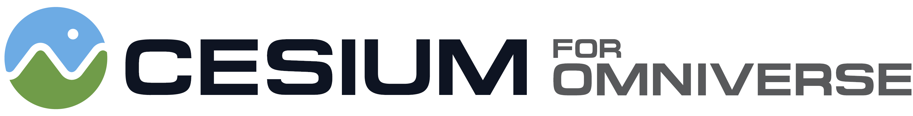
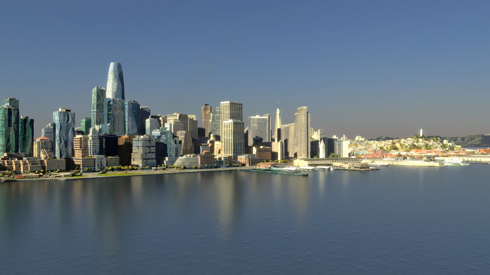

# Cesium for Omniverse Samples

The Cesium for Omniverse Samples contains a series of USD files to help learn and explore the [Cesium for Omniverse](https://cesium.com/platform/cesium-for-omniverse) extension.

The USDs in this project will walk you through the extension's features and demonstrate global-scale content and experiences in Nvidia Omniverse USD Composer.

The source code for Cesium for Omniverse itself may be found in the [cesium-omniverse](https://github.com/CesiumGS/cesium-omniverse) repo.

*
Photogrammetry of San Francisco, California visualized in Omniverse USD Composer, using Cesium for Omniverse. Open <b>examples/SanFrancisco/SanFrancisco.usd</b> in Omniverse USD Composer to experience it yourself!
*

### :rocket: Get Started

1. **[Download Cesium for Omniverse Samples](https://github.com/CesiumGS/cesium-omniverse-samples/releases/latest)**.
2. Extract the `.zip` file into a suitable location on your computer.
3. Follow the Quickstart tutorial to setup Cesium for Omniverse with Omniverse USD Composer.
4. Open any of the USD files within this repo to explore them.

Have questions? Ask them on the [community forum](https://community.cesium.com).

## :mountain: USD Descriptions

The content in this repo is split into two main folders - Examples and Tutorials.

### :one: Examples Folder

The example folder contain cities built with various datasets, high quality lighting, and rendering settings optimised for real-time interaction whilst also providing high quality image and video outputs. 

#### Denver 
In Denver you'll see [Cesium World Terrain](https://cesium.com/platform/cesium-ion/content/cesium-world-terrain/) combined with photogrammetry of the city center, captured by [Aerometrex](https://aerometrex.com.au/).

#### San Francisco 
In San Francisco you'll see [Cesium World Terrain](https://cesium.com/platform/cesium-ion/content/cesium-world-terrain/) combined with photogrammetry of the city, captured by [Aerometrex](https://aerometrex.com.au/).

#### Vancouver
In Vancouver you'll see [Cesium World Terrain](https://cesium.com/platform/cesium-ion/content/cesium-world-terrain/) combined with [Cesium OSM Buildings](https://cesium.com/platform/cesium-ion/content/cesium-osm-buildings/).

### :two: Tutorials Folder

The tutorial folder contain USD's representing the completed steps of each tutorial found [here](https://cesium.com/learn/omniverse/).

If you want to see the intended outcome of each tutorial, simply open the corresponding USD.

### :green_book:License

[Apache 2.0](http://www.apache.org/licenses/LICENSE-2.0.html). Cesium for Omniverse Samples is free to use as starter project for both commercial and non-commercial use.
